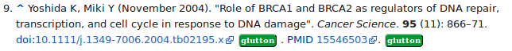
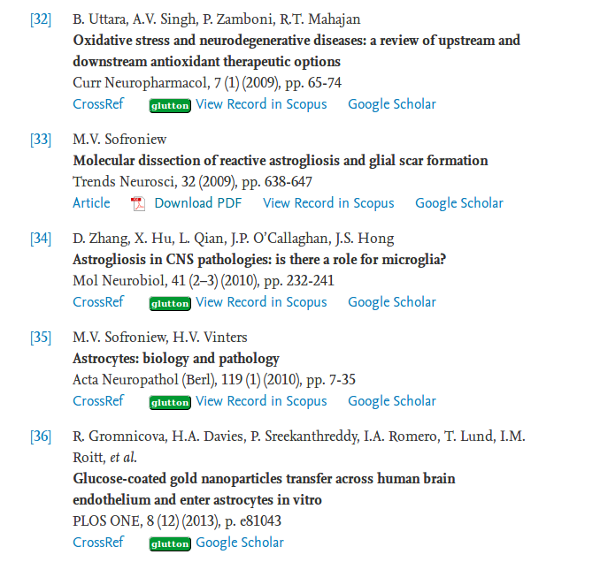

# biblio-glutton-extension

A browser extension for providing bibliographical services:

- identifying dynamically Open Access resources in the browser pages

- provide contextual citation services

This extension is an adaptation of [istex-browser-addon](https://github.com/istex/istex-browser-addon).

## Functionalities

This browser extension performs the following task:

* Add a Glutton button next to any DOI, PMID, PMCID, PII and OpenUrl found in the browser page in case the corresponding document is available as Open Access, based on the Unpaywall dataset. Clicking on the Glutton button will open a new tab with the corresponding PDF. 

## Examples






## Supported identifiers and protocols

Linking work at item level (e.g. article) and will try to identifying the following identifiers in the web page:

* DOI
* PubMed ID (PMID)
* PubMed Central ID
* Publisher Item Identifier (PII)
* OpenURL 1.0, including COInS - link resolver prefixes will be examined in case of SFX and Proquest 360 Link

## Supported browsers

* Firefox

* Chrome

## How to install

...

## Developers

How to build the artefact:
```
npm i
npm run build
```

How to run the web extension in developer mode with firefox (you need to install firefox >= 49):
```
npm i
npm run run
``` 

## Back end service

The extension requires a functional [biblio-glutton](https://github.com/kermitt2/biblio-glutton) service. By default, the science-miner biblio-glutton service is used, but you can install your own biblio-glutton server to optimize response time, add your own repositories or local subscription access information. 
 
# License and contact

biblio-glutton-extension is distributed under [Apache 2.0 license](http://www.apache.org/licenses/LICENSE-2.0). 

Main author and contact: Patrice Lopez (<patrice.lopez@science-miner.com>)
